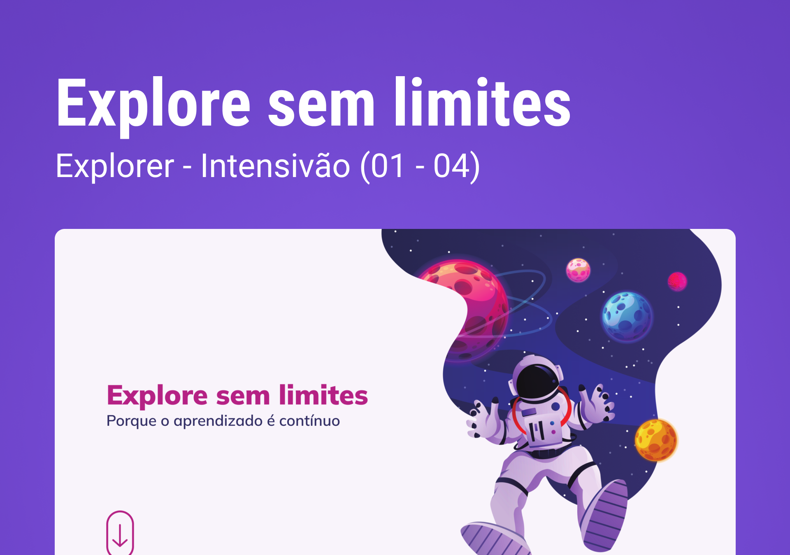

 

## 🖥️ Projeto 
Esse é um projeto Web Responsivo, do intensivão, para aprimoramento de ideias e desenvolvimento de tecnologias.

## 🚀 Tecnologias
Esse projeto foi desenvolvido durante o NLW da Rocketseat com as seguintes tecnologias:

- HTML
- CSS
- Git e Github

## 🏷️ Layout
Você pode visualizar o layoout do projeto através
[desse link](https://www.figma.com/file/rNY9n2S7fvubyCczuH3tqP/Explore-sem-limites-(Copy)?type=design&node-id=1-2&mode=design&t=dv8CxXXp7sZtaNYA-0).
É necessário ter uma conta no [Figma](https://www.figma.com)